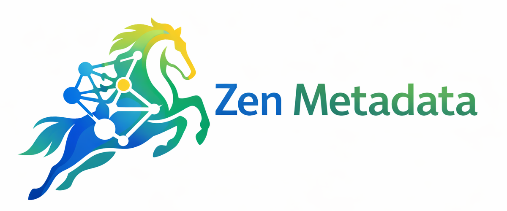

<div align="center">



# Zen Metadata

**Unified Metadata Management System | Self-Evolving Semantic System Kernel | Graph Database-Based Metadata Management Platform**

[](https://opensource.org/licenses/MIT)
[](https://www.python.org/)
[](https://www.typescriptlang.org/)
[](https://react.dev/)
[](https://fastapi.tiangolo.com/)

[English](README_EN.md) • [中文](README.md)

[Features](#-features) • [Quick Start](#-quick-start) • [Documentation](#-documentation) • [Contributing](#-contributing) • [License](#-license)

</div>

---

## 📖 Introduction

**Zen Metadata** is a unified metadata management system based on graph databases, designed to achieve unified management of metadata for everything, supporting large language models (LLMs) for semantic understanding and interaction. The system adopts a frontend-backend separation architecture, providing complete capabilities for metadata collection, storage, query, analysis, and visualization.

### 🧠 Core Vision: Self-Evolving Semantic System Kernel

The core goal of Zen Metadata is to build **a self-evolving semantic system kernel** that serves as an intelligent foundation for deep integration with large language models. This kernel is capable of:

- **Semantic Understanding & Reasoning**: Deep semantic understanding and relationship reasoning based on graph database metadata relationship graphs
- **Self-Learning & Optimization**: Continuously learning and optimizing semantic representations and relationship mappings of metadata through interactions with LLMs
- **Dynamic Evolution**: Automatically adjusting and expanding semantic models based on usage feedback and new metadata inputs
- **Intelligent Recommendation**: Providing intelligent metadata recommendations and context enhancement for LLMs based on semantic similarity and relationship paths

This semantic system kernel will serve as a bridge connecting the metadata world with the AI world, enabling large language models to understand and utilize structured metadata more deeply.

### ✨ Core Values

- 🎯 **Unified Management**: One-stop management of all types of metadata
- 🔍 **Intelligent Query**: Support for complex graph queries and relationship analysis
- 📊 **Visualization**: Interactive metadata graph visualization
- 🤖 **LLM-Friendly**: Provides structured metadata access interfaces for LLMs
- 🧠 **Self-Evolving**: Building a self-evolving semantic system kernel that continuously optimizes semantic understanding capabilities
- 🔌 **Extensible**: Plugin-based collector framework for easy extension of new data sources

---

## 🚀 Features

### 💾 Data Storage

- **Graph Database Storage**: Based on FalkorDB for storing metadata relationship graphs, supporting complex graph queries and relationship analysis
- **Multi-Data Source Support**: SQLite (relational) and DuckDB (analytical) data processing to meet different scenario needs
- **Data Synchronization**: Automatic synchronization between graph database and relational database

### 📥 Metadata Collection

- **Extensible Collector Framework**: Support for collecting metadata from various sources
  - Relational database collectors (PostgreSQL, MySQL, SQLite)
  - Graph database collectors (Neo4j, FalkorDB)
  - Programming language code metadata collectors (Python, JavaScript, TypeScript, Java)
  - File system metadata collectors
- **Asynchronous Task Management**: Support for long-running collection tasks with task status tracking and progress monitoring
- **WebSocket Real-time Communication**: Real-time push of task status and collection progress

### 📊 Visualization & Analysis

- **Web Frontend Interface**: Modern frontend interface based on React + TypeScript + Ant Design
- **Graph Visualization**: Interactive metadata graph display based on Graphiti and ReactFlow
- **Data Analysis**: High-performance data analysis and statistics based on DuckDB
- **Multi-view Display**: Support for dashboard, entity browser, graph view, analysis view, and other display modes

### 🔌 API & Integration

- **RESTful API**: Complete FastAPI backend service providing standardized metadata access interfaces
- **Data Export**: Support for multiple format data export (JSON, CSV, GraphML, etc.)
- **LLM Integration Support**: Provides structured metadata access interfaces for LLMs, supporting semantic queries
- **Self-Evolving Semantic System Kernel**: Building an intelligent semantic kernel that achieves self-learning and optimization through interactions with large language models
  - Semantic understanding and reasoning engine
  - Dynamic semantic model evolution
  - Intelligent metadata recommendation system
  - Context-aware semantic enhancement

---

## 🏗️ System Architecture

```
┌─────────────────────────────────────────────────────────┐
│                    Graphiti Visualization Layer          │
└─────────────────────────────────────────────────────────┘
                            ↓
┌─────────────────────────────────────────────────────────┐
│                    API Service Layer                     │
└─────────────────────────────────────────────────────────┘
                            ↓
┌─────────────────────────────────────────────────────────┐
│  Self-Evolving Semantic System Kernel (LLM Integration)  │
│  ├─ Semantic Understanding & Reasoning Engine           │
│  ├─ Dynamic Semantic Model Evolution                    │
│  ├─ Intelligent Metadata Recommendation System           │
│  └─ Context-Aware Semantic Enhancement                 │
└─────────────────────────────────────────────────────────┘
                            ↓
┌─────────────────────────────────────────────────────────┐
│  Metadata Collector Layer (Extensible)                   │
│  ├─ Relational Database Collectors                      │
│  ├─ Graph Database Collectors                           │
│  ├─ Code Metadata Collectors                            │
│  └─ File System Collectors                              │
└─────────────────────────────────────────────────────────┘
                            ↓
┌─────────────────────────────────────────────────────────┐
│                    Data Storage Layer                     │
│  ├─ FalkorDB (Graph Database - Metadata Relationships)  │
│  ├─ SQLite (Relational Data)                            │
│  └─ DuckDB (Analytical Data)                           │
└─────────────────────────────────────────────────────────┘
```

---

## 🛠️ Tech Stack

### Backend
- **Python 3.10+** - Main development language
- **FalkorDB** - Graph database for storing metadata relationship graphs
- **SQLite** - Relational database for structured data storage
- **DuckDB** - Analytical database for high-performance data analysis
- **FastAPI** - Modern web framework providing RESTful API
- **Pydantic** - Data validation and serialization
- **Uvicorn** - ASGI server
- **Tree-sitter** - Code parsing and metadata extraction
- **SQLAlchemy** - Database ORM and connection management

### Frontend
- **React 19** - UI framework
- **TypeScript** - Type-safe JavaScript
- **Ant Design** - Enterprise-level UI component library
- **ReactFlow** - Graph visualization component
- **ECharts** - Data visualization chart library
- **Zustand** - State management
- **React Router** - Route management
- **Axios** - HTTP client
- **Vite** - Build tool

### Tools & Libraries
- **Graphiti** - Graph visualization library
- **NetworkX** - Graph analysis library
- **Plotly** - Interactive chart library
- **Pandas** - Data processing library
- **Redis** - Cache and task queue

---

## 📦 Project Structure

```
zen-metadata/
├── README.md                 # Project documentation
├── README_EN.md             # English documentation
├── ARCHITECTURE.md           # System architecture documentation
├── QUICKSTART.md            # Quick start guide
├── PROJECT_STRUCTURE.md     # Project structure documentation
├── DEPLOYMENT.md            # Deployment documentation
├── IMPLEMENTATION_SUMMARY.md # Implementation summary
├── requirements.txt         # Python dependencies
├── setup.py                 # Installation script
├── run.py                   # Quick start script
├── .gitignore               # Git ignore file
│
├── config/                  # Configuration directory
│   └── config.yaml          # Main configuration file
│
├── src/                     # Source code directory
│   ├── core/                # Core modules
│   │   ├── models.py        # Data model definitions
│   │   ├── graph.py         # FalkorDB graph database operations
│   │   ├── storage.py        # Storage layer abstract interface
│   │   └── tasks.py         # Task management
│   ├── collectors/          # Collector modules
│   │   ├── base.py          # Collector base class
│   │   ├── relational.py    # Relational database collectors
│   │   ├── graphdb.py       # Graph database collectors
│   │   ├── code.py          # Code metadata collectors
│   │   └── filesystem.py    # File system collectors
│   ├── processing/          # Data processing modules
│   │   ├── sqlite.py        # SQLite relational data processing
│   │   ├── duckdb.py        # DuckDB analytical data processing
│   │   └── sync.py          # Data synchronization
│   ├── visualization/       # Visualization modules
│   │   └── graphiti.py      # Graphiti visualization integration
│   └── api/                 # API service modules
│       ├── server.py        # FastAPI main service
│       ├── tasks.py         # Task management API
│       ├── export.py        # Data export API
│       └── websocket.py     # WebSocket real-time communication
│
├── frontend/                # Frontend application
│   ├── src/
│   │   ├── components/      # React components
│   │   │   └── Layout/      # Layout components
│   │   ├── pages/           # Page components
│   │   │   ├── Dashboard/   # Dashboard
│   │   │   ├── EntityBrowser/ # Entity browser
│   │   │   ├── GraphView/   # Graph view
│   │   │   ├── Collection/  # Collection management
│   │   │   └── Analytics/  # Data analysis
│   │   ├── services/        # API services
│   │   ├── store/           # State management
│   │   └── types/           # TypeScript type definitions
│   ├── package.json         # Frontend dependencies
│   └── vite.config.ts       # Vite configuration
│
├── examples/                # Example code
│   ├── basic_usage.py       # Basic usage examples
│   └── llm_integration.py   # LLM integration examples
│
├── data/                    # Data directory (auto-created)
│   ├── zen_metadata.db      # SQLite database
│   └── zen_metadata_analytics.duckdb  # DuckDB database
│
└── logs/                    # Log directory (auto-created)
```

---

## 🚀 Quick Start

### Requirements

- Python 3.10 or higher
- Node.js 16+ and npm (for frontend development)
- Redis/FalkorDB service (for graph database)

### Installation Steps

#### 1. Clone Repository

```bash
git clone https://github.com/your-username/zen-metadata.git
cd zen-metadata
```

#### 2. Install Backend Dependencies

```bash
pip install -r requirements.txt
```

#### 3. Install Frontend Dependencies

```bash
cd frontend
npm install
cd ..
```

#### 4. Configuration

Edit `config/config.yaml` to set database connections and collector configurations. For detailed configuration instructions, please refer to [QUICKSTART.md](QUICKSTART.md).

#### 5. Start Services

**Start Backend API Service:**

```bash
python run.py
```

Or use uvicorn directly:

```bash
uvicorn src.api.server:app --host 0.0.0.0 --port 8000 --reload
```

**Start Frontend Development Server:**

```bash
cd frontend
npm run dev
```

#### 6. Access Application

- **API Documentation**: http://localhost:8000/docs
- **Frontend Application**: http://localhost:5173 (Vite default port)

---

## 💡 Usage Examples

### Collect Metadata via API

```bash
# Collect file system metadata
curl -X POST "http://localhost:8000/api/collect" \
  -H "Content-Type: application/json" \
  -d '{
    "collector_type": "filesystem",
    "config": {
      "scan_paths": ["/path/to/scan"],
      "source": "my_filesystem"
    }
  }'
```

### Use via Python SDK

```python
from src.collectors.filesystem import FileSystemCollector
from src.core.graph import GraphStore

# Create collector
collector = FileSystemCollector(
    scan_paths=["/path/to/scan"],
    source="my_filesystem"
)

# Execute collection
result = collector.collect()

# Store to graph database
graph_store = GraphStore()
graph_store.batch_add_entities(result.entities)
graph_store.batch_add_relationships(result.relationships)

# Query metadata graph
results = graph_store.query("MATCH (n)-[r]->(m) RETURN n, r, m LIMIT 10")
```

### More Examples

Check the example code in the [examples/](examples/) directory:
- `basic_usage.py`: Basic usage examples
- `llm_integration.py`: LLM integration examples

For detailed usage instructions, please refer to [QUICKSTART.md](QUICKSTART.md).

---

## 📊 Development Status

### ✅ Completed Features

- [x] Project architecture design
- [x] Core data model implementation
- [x] Collector framework implementation
- [x] Various type collector implementations
  - [x] Relational database collectors
  - [x] Graph database collectors
  - [x] Code metadata collectors
  - [x] File system collectors
- [x] Graph database storage (FalkorDB)
- [x] Relational database storage (SQLite)
- [x] Analytical database (DuckDB)
- [x] FastAPI RESTful API
- [x] Task management system
- [x] WebSocket real-time communication
- [x] Data export functionality
- [x] Frontend base framework (React + TypeScript)
- [x] Frontend page components
  - [x] Dashboard
  - [x] Entity browser
  - [x] Graph view
  - [x] Collection management
  - [x] Data analysis

### 🚧 Development Roadmap

See [ROADMAP.md](ROADMAP.md) for detailed development plans.

---

## 📚 Documentation

- [ARCHITECTURE.md](ARCHITECTURE.md) - Detailed system architecture documentation
- [QUICKSTART.md](QUICKSTART.md) - Quick start guide
- [PROJECT_STRUCTURE.md](PROJECT_STRUCTURE.md) - Project structure documentation
- [DEPLOYMENT.md](DEPLOYMENT.md) - Deployment guide
- [IMPLEMENTATION_SUMMARY.md](IMPLEMENTATION_SUMMARY.md) - Implementation summary

---

## 🤝 Contributing

We welcome all forms of contributions! Whether it's reporting issues, making suggestions, or submitting code, we greatly appreciate it.

### Ways to Contribute

1. **Report Issues**: Report bugs or suggest features in [Issues](https://github.com/your-username/zen-metadata/issues)
2. **Submit Code**: Fork the project, create a feature branch, and submit a Pull Request
3. **Improve Documentation**: Help improve documentation and example code

### Contribution Guidelines

Before starting to contribute, please read the following documents:
- [ARCHITECTURE.md](ARCHITECTURE.md) - Understand the system architecture
- [PROJECT_STRUCTURE.md](PROJECT_STRUCTURE.md) - Understand the project structure
- [QUICKSTART.md](QUICKSTART.md) - Quick start development

### Development Workflow

1. Fork this repository
2. Create your feature branch (`git checkout -b feature/AmazingFeature`)
3. Commit your changes (`git commit -m 'Add some AmazingFeature'`)
4. Push to the branch (`git push origin feature/AmazingFeature`)
5. Open a Pull Request

---

## 📄 License

This project is licensed under the [MIT License](LICENSE).

```
MIT License

Copyright (c) 2024 Zen Metadata Contributors

Permission is hereby granted, free of charge, to any person obtaining a copy
of this software and associated documentation files (the "Software"), to deal
in the Software without restriction, including without limitation the rights
to use, copy, modify, merge, publish, distribute, sublicense, and/or sell
copies of the Software, and to permit persons to whom the Software is
furnished to do so, subject to the following conditions:

The above copyright notice and this permission notice shall be included in all
copies or substantial portions of the Software.

THE SOFTWARE IS PROVIDED "AS IS", WITHOUT WARRANTY OF ANY KIND, EXPRESS OR
IMPLIED, INCLUDING BUT NOT LIMITED TO THE WARRANTIES OF MERCHANTABILITY,
FITNESS FOR A PARTICULAR PURPOSE AND NONINFRINGEMENT. IN NO EVENT SHALL THE
AUTHORS OR COPYRIGHT HOLDERS BE LIABLE FOR ANY CLAIM, DAMAGES OR OTHER
LIABILITY, WHETHER IN AN ACTION OF CONTRACT, TORT OR OTHERWISE, ARISING FROM,
OUT OF OR IN CONNECTION WITH THE SOFTWARE OR THE USE OR OTHER DEALINGS IN THE
SOFTWARE.
```

---

## ⭐ Star History

If this project helps you, please consider giving it a Star ⭐!

---

<div align="center">

**Made with ❤️ by Zen Metadata Team**

[⬆ Back to Top](#-zen-metadata)

</div>

