# Zen Metadata 项目功能实现逻辑分析文档

## 1. 项目概述

Zen Metadata 是一个基于图数据库的统一元数据管理系统，旨在实现万事万物的元数据统一管理，支撑大模型进行语义理解和交互。系统采用前后端分离架构，提供完整的元数据采集、存储、查询、分析和可视化能力。

### 1.1 核心设计理念

- **统一性**：所有元数据统一表示为实体（Entity）和关系（Relationship）
- **可扩展性**：采用插件化采集器架构，易于添加新的数据源
- **多存储支持**：同时支持图数据库（FalkorDB）、关系型数据库（SQLite）和分析型数据库（DuckDB）
- **语义化**：支持丰富的元数据类型和关系类型，为LLM提供结构化语义信息

## 2. 系统架构

### 2.1 整体架构图

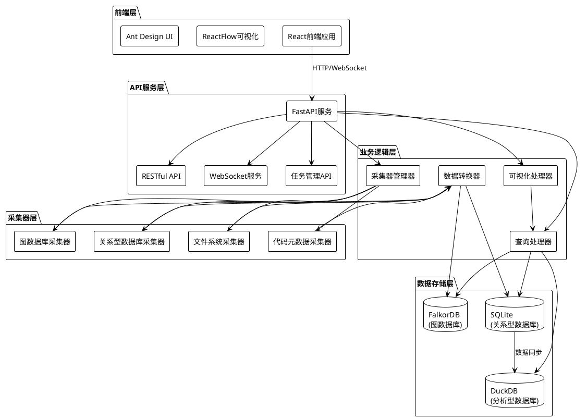

### 2.2 分层架构说明

系统采用经典的分层架构设计：

1. **展示层**：React + TypeScript 前端应用，提供用户交互界面
2. **API服务层**：FastAPI 提供 RESTful API 和 WebSocket 实时通信
3. **业务逻辑层**：处理采集、转换、查询、可视化等核心业务逻辑
4. **采集器层**：可扩展的采集器框架，支持多种数据源
5. **数据存储层**：多数据库支持，满足不同场景需求

## 3. 核心数据模型

### 3.1 数据模型类图

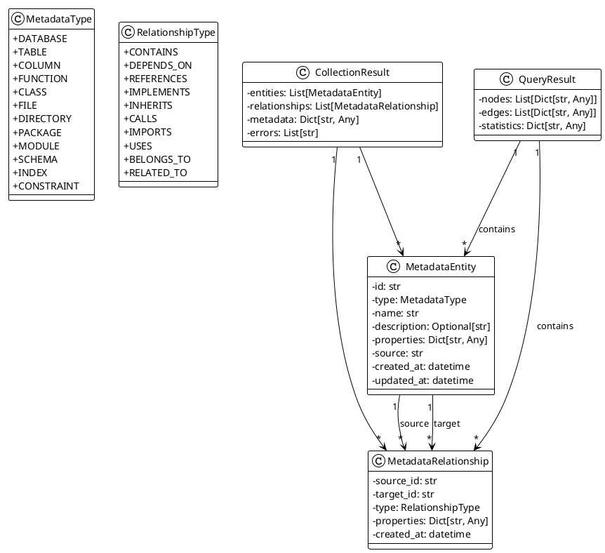

### 3.2 数据模型说明

- **MetadataEntity（元数据实体）**：表示系统中的各种元数据对象，如数据库、表、函数、文件等
- **MetadataRelationship（元数据关系）**：表示实体之间的关系，如包含、依赖、引用等
- **CollectionResult（采集结果）**：采集器返回的结果，包含实体列表和关系列表
- **QueryResult（查询结果）**：图查询返回的结果，包含节点、边和统计信息

## 4. 采集器架构

### 4.1 采集器类图

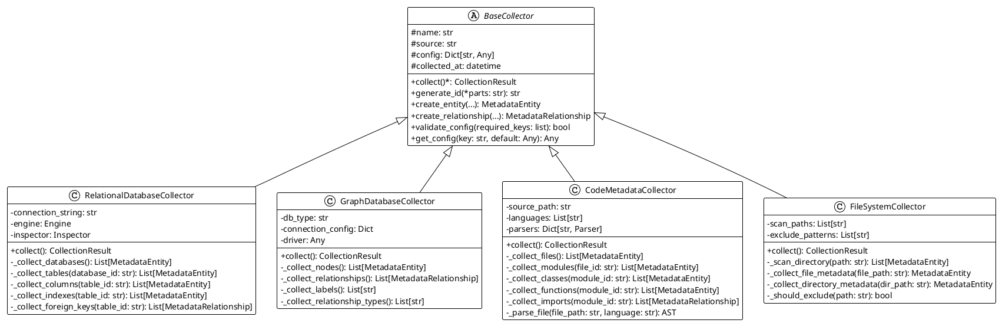

### 4.2 采集器工作流程

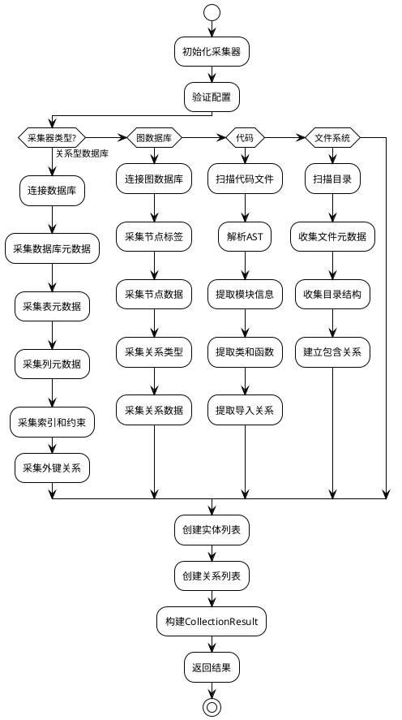

## 5. 数据存储架构

### 5.1 存储层类图

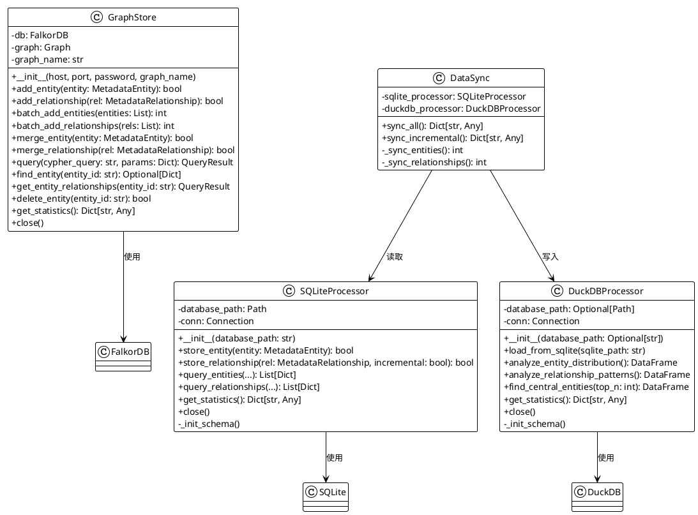

### 5.2 数据存储流程

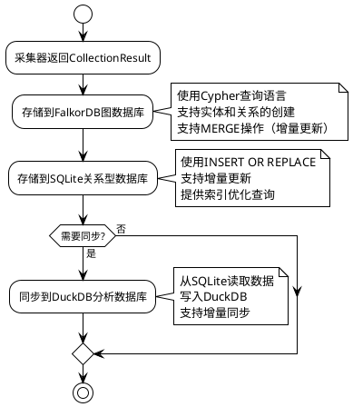

## 6. API服务架构

### 6.1 API服务类图

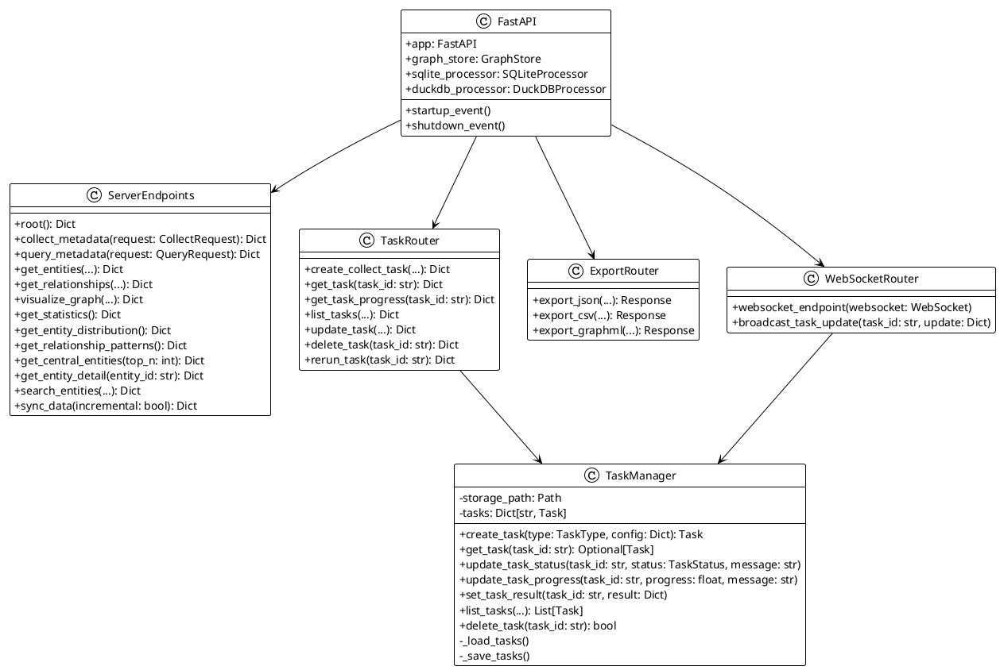

### 6.2 API请求处理流程

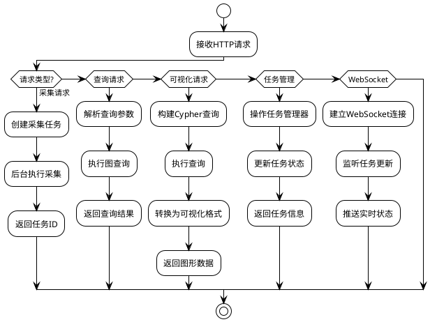

## 7. 任务管理系统

### 7.1 任务管理类图

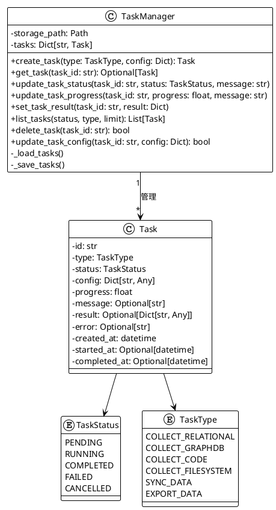

### 7.2 任务执行流程

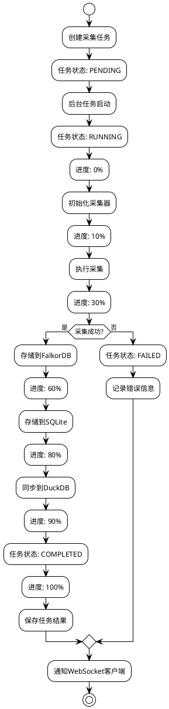

## 8. 数据查询与分析

### 8.1 查询处理流程

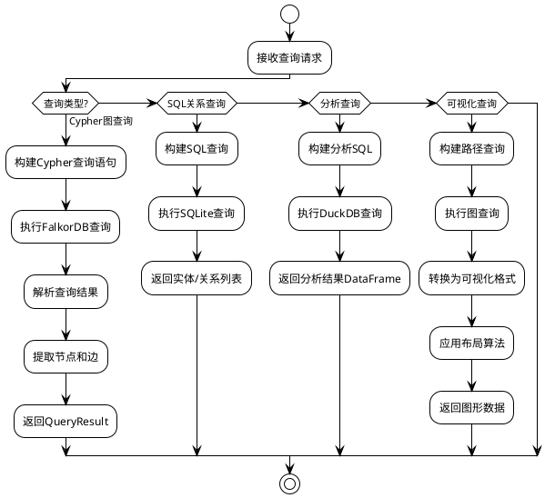

### 8.2 分析功能

系统提供以下分析功能：

1. **实体分布分析**：统计各类型实体的数量和分布
2. **关系模式分析**：分析不同类型关系的使用频率和模式
3. **中心实体发现**：找出连接度最高的实体（度中心性）

## 9. 前端架构

### 9.1 前端组件结构

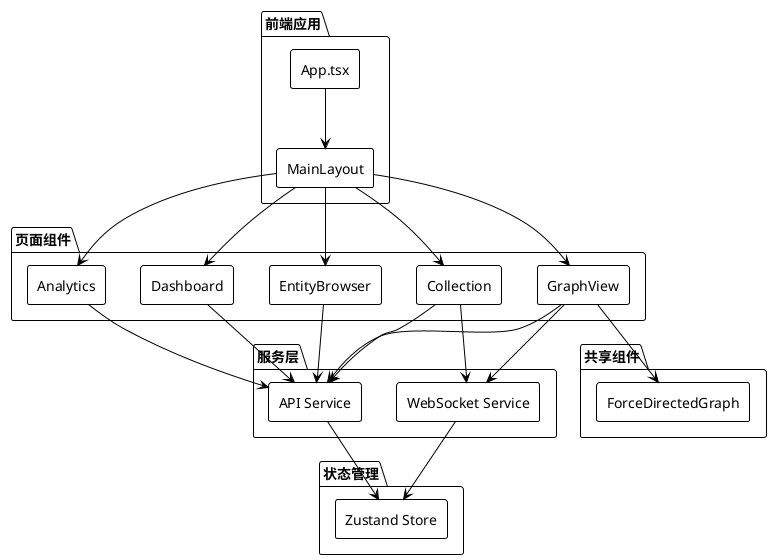

### 9.2 前端数据流

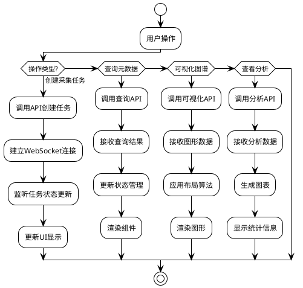

## 10. 关键技术实现

### 10.1 图数据库操作

系统使用FalkorDB作为图数据库，主要特点：

- 使用Cypher查询语言
- 支持节点和关系的创建、查询、更新、删除
- 支持MERGE操作实现增量更新
- 自动处理属性类型转换（复杂类型转为JSON字符串）

### 10.2 数据同步机制

系统实现了SQLite到DuckDB的数据同步：

- **全量同步**：首次同步所有数据
- **增量同步**：只同步新增或更新的数据
- 使用时间戳判断数据变更

### 10.3 任务管理

- 任务状态持久化到JSON文件
- 支持任务进度实时更新
- WebSocket推送任务状态变更
- 支持任务重跑（增量采集模式）

### 10.4 可视化处理

- 使用Graphiti进行图形可视化
- 支持多种布局算法（spring, force-directed等）
- 支持子图提取和类型过滤
- 前端使用ReactFlow渲染交互式图形

## 11. 系统扩展点

### 11.1 添加新采集器

1. 继承`BaseCollector`基类
2. 实现`collect()`方法
3. 返回`CollectionResult`对象
4. 在API中注册新的采集器类型

### 11.2 添加新存储后端

1. 实现存储接口（参考`GraphStore`、`SQLiteProcessor`）
2. 实现CRUD操作
3. 在启动时初始化存储实例
4. 在API中使用新的存储后端

### 11.3 添加新分析功能

1. 在`DuckDBProcessor`中添加分析方法
2. 在API中添加对应的端点
3. 在前端添加可视化组件

## 12. 性能优化策略

### 12.1 批量操作

- 使用批量插入减少数据库交互
- 批量添加实体和关系

### 12.2 索引优化

- 在常用查询字段上创建索引
- 图数据库自动索引节点和关系

### 12.3 缓存策略

- 缓存常用查询结果
- 缓存统计信息

### 12.4 异步处理

- 长时间运行的采集任务使用后台任务
- WebSocket实时推送任务状态

## 13. 总结

Zen Metadata系统通过以下方式实现了统一元数据管理：

1. **统一的数据模型**：所有元数据统一表示为实体和关系
2. **可扩展的采集器架构**：易于添加新的数据源
3. **多存储支持**：满足不同场景的查询和分析需求
4. **完整的API服务**：提供RESTful API和WebSocket实时通信
5. **丰富的可视化**：支持交互式图谱展示和分析

系统设计遵循了可扩展性、统一性和语义化的核心原则，为元数据管理和LLM集成提供了坚实的基础。

